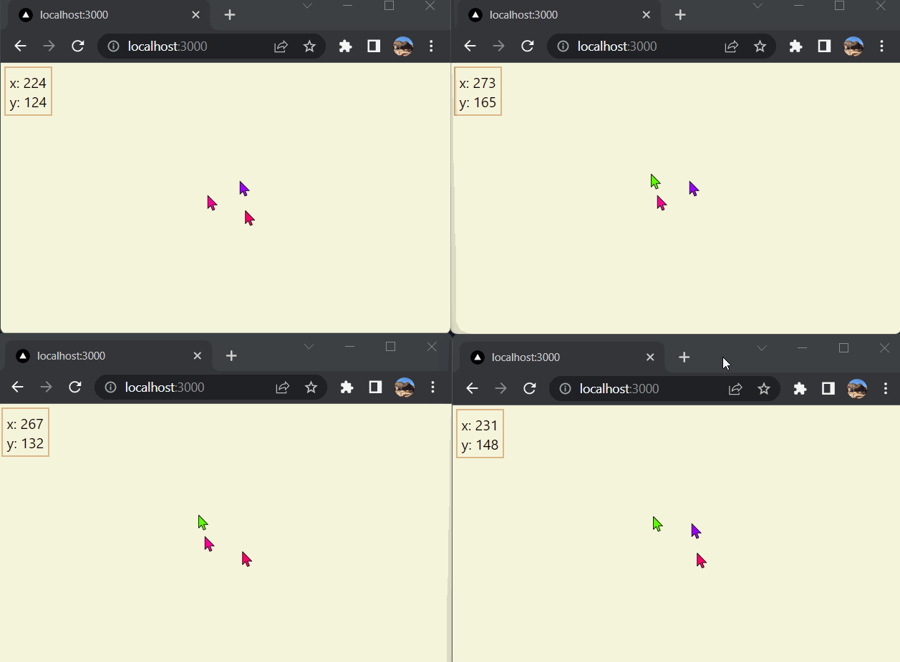

# websocket-cursors

Websocket test dynamically creates JSX cursor elements based on connections. Server continuously broadcoasts mouse position of connected clients and assigns each one a unique id and color.

Uses [ws](https://github.com/websockets/ws) for server-side socket connection.
